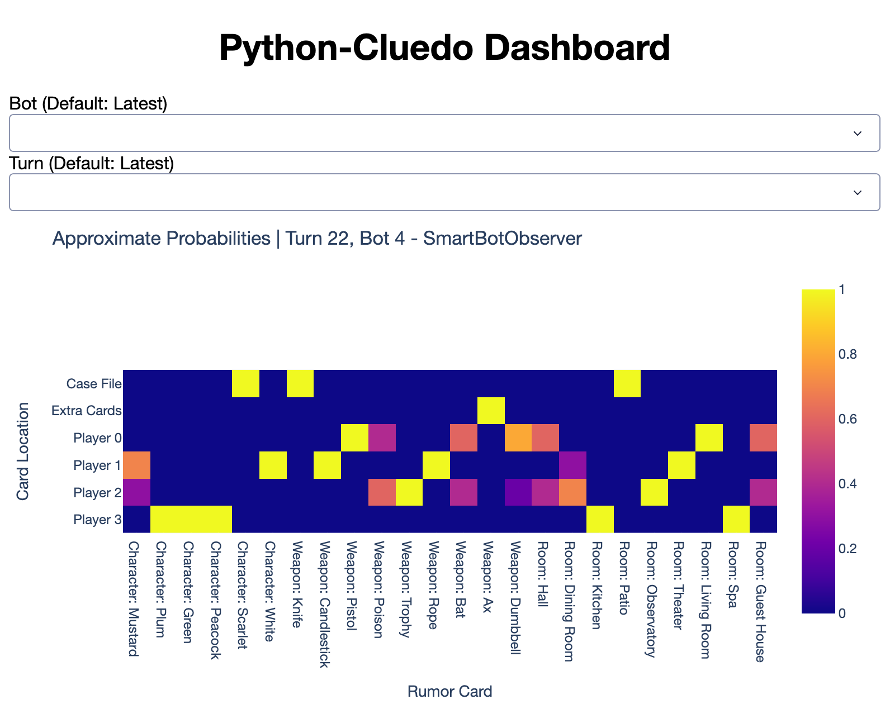

# `python-cluedo`: Cluedo Bot and Simulator

🎶 _It's not a game; I'm not a robot AI challenging you..._ 🎶

Except this is a game; the name of the game is Cluedo, and you are indeed being challenged by a robot AI.

`python-cluedo` is software for the 70-year-old board game Cluedo (Clue in North America). It includes the following components:

- Cluedo bot
- Cluedo simulator
- Cluedo assistant
- Dashboard

## Demo video

<!-- Working video link generated by uploading `docs/cluedo_simulator_dashboard_demo.mp4` into a unsubmitted GH issue. -->

https://github.com/user-attachments/assets/73e26247-9948-41cf-a045-cd7661a090e8

The simulator and bot are significantly faster than depicted here; in dashboard mode, they are slowed down to be able to see how the probabilities change over the course of the game.

## The rules of the game

The context of each Cluedo game is that a crime has taken place. A crime consists of a murder weapon, a character who was murdered[^1], and a room on the game board in which the murder took place. One wins by being the first to correctly guess the crime (weapon, character, and room). Players take turns starting _rumors_ about what the crime was and responding to other players' rumors, thereby narrowing down the possible weapons, characters, and rooms. When a player is confident enough, they can guess what the crime was. They must be confident enough because, if their guess is incorrect, they will be disqualified from the game.

## Cluedo bot

The Cluedo bot is guaranteed to isolate the correct crime. The bot will win by doing so faster than an expert human player (unless that human is running the bot on their computer!).

The bot can be either an **observer** or a **player** of the game. As an observer, the bot acts as a bystander and does not affect the gameplay (except perhaps by making the players nervous). Incredibly, the bot will solve the crime even as a mere observer, who never sees any cards[^2]!

**The bot as an observer:** As an observer, the bot regularly collects information from the gameplay and tries to isolate a solution to the crime. If not shown any of the extra "rumor" cards at the beginning of the game, it will identify the point in the gameplay when knowing those extra cards is the only thing left that it needs to solve the game. Looking at those cards is the only time when any cards are revealed to the bot, after which it immediately solves the crime.

**The bot as a player:** When the bot is directly playing the game, it does everything that it does as an observer, but it also interacts with the other players. The bot will solve the crime faster because it can _start rumors_ in order to _see other players' rumor cards_, thus more directly ruling out the possibilities of the crime. The bot also chooses which cards to show other players in response to their rumors, thus affecting their deductions.

## Cluedo simulator

The Cluedo simulator sets up and runs virtual games of Cluedo between an arbitrary number of players. The players can be bots (with different strategies), humans (with worse strategies), or a mix of both.

Humans playing the game receive gameplay information from the simulation and enter their decisions as the game unfolds.

With only bot players, one simulated game takes only seconds and some twenty turns before _every_ bot has solved the crime. Each game setup and gameplay has random elements, but by running multiple simulated games, luck-of-the-draw is ruled out and different strategies of bots can be compared.

```sh
uv run cluedo_simulator.py --n-bot-players 4 --include-observer --dashboard
```

## Cluedo assistant

Not unlike the Cluedo simulator, the Cluedo assistant allows bot–human interaction. However, you and the bot are on the same side against the other players.

You serve as the eyes, ears, and hands of the Cluedo assistant. While you're sneakily typing in the rumors that other players are starting and answering, the assistant's role is to take the guesswork (and fun) out of the game. By solving the crime for you as quickly as possible, the assistant brings family game night to a premature and bitter end.

```sh
uv run cluedo_assistant.py --dashboard
```

## Getting started

1. [Download](https://github.com/keeganmjgreen/python-cluedo/archive/refs/heads/main.zip) or clone the repo.
2. With the [uv package manager](https://docs.astral.sh/uv/) installed, run `uv sync` to install the repo's dependencies.
3. Run one of the above commands to start the Cluedo assistant or simulator.

## [Up and running in ten seconds](https://colab.research.google.com/github/keeganmjgreen/python-cluedo/blob/main/python_cluedo.ipynb)

You can use the Cluedo simulator or Cluedo assistant _right now_ by following [this link](https://colab.research.google.com/github/keeganmjgreen/python-cluedo/blob/main/python_cluedo.ipynb) to a Python notebook in Google Colaboratory, a free online Python runtime, and following the simple instructions therein. Note that you need to be signed into a Google account to use Colaboratory.

## Dashboard

The `--dashboard` CLI flag opens the `python-cluedo` dashboard. The dashboard shows, from the perspective of each bot, the approximate probabilities of each rumor card being in each possible location (in a player's hand, in the "case file", or among the extra cards). The dashboard updates in real time as the game progresses, allowing you to see how each bot narrows down the contents of the case file.



[^1]: Indeed, this makes no sense, because the murdered character can still participate in the game.

[^2]: Except those cards which are mandatory to see.
